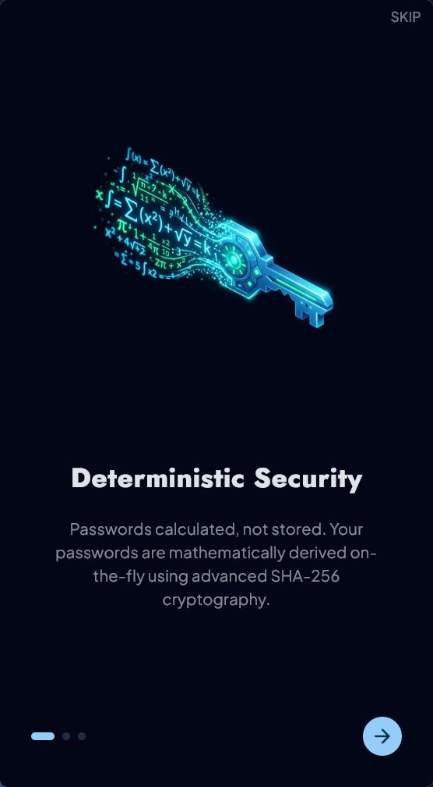
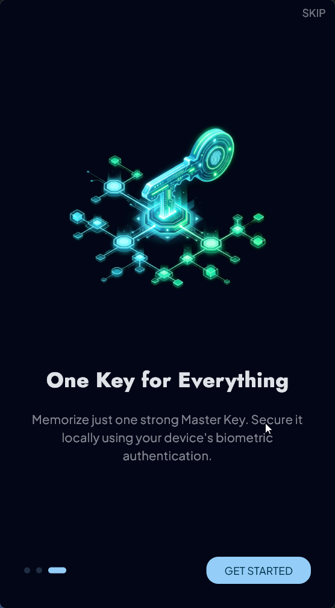
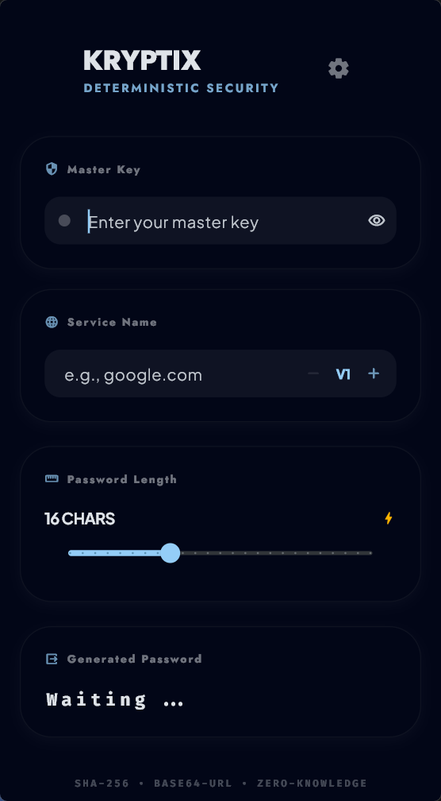
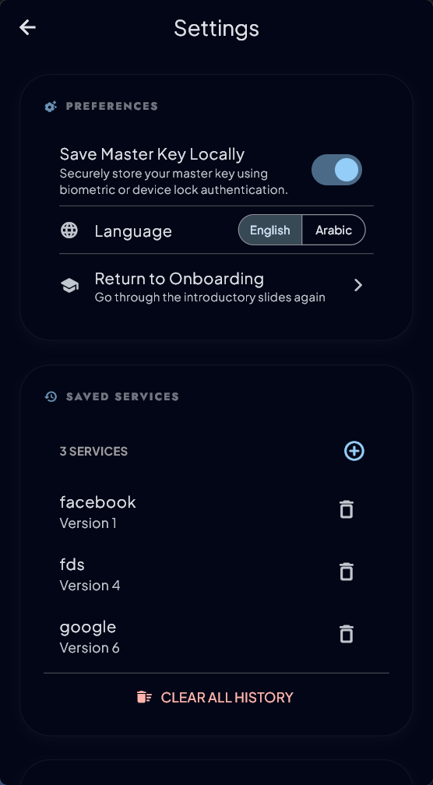

# Kryptix

A premium, deterministic, **Zero-Knowledge** password manager built with Flutter.

Kryptix generates high-entropy, secure passwords using only a **Master Key** and a **Service Name** (e.g., `google.com`). Because it is deterministic, passwords are never stored — you simply re-generate them whenever you need them.

## Preview

| SECURITY | PRIVACY | SIMPLICITY | KRYPTIX  | SETTINGS |
|---|---|---|---|---|
|  |  |  |  |  |

## Key Features

- **Zero-Knowledge Architecture**: Your Master Key and generated passwords never leave your device. Nothing is ever sent to a server.
- **Deterministic Generation**: The same inputs always produce the same password. No database required.
- **Key Stretching**: Uses **50,000 iterations** of SHA-256 to harden your Master Key against brute-force attacks.
- **Service Versioning**: Rotate passwords by incrementing the version (v1, v2, etc.) for any service.
- **Cross-Platform**: Built for Mobile (Android/iOS), Desktop (Windows/macOS/Linux), and Web.
- **Bento UI**: A clean, modern, and responsive user interface.
- **Smart History**: Remembers your recently used services locally for quick autocomplete.
- **Biometric Auth**: Secure your saved Master Key with device biometrics.
- **Localization**: Supports English and Arabic (RTL).

## How it Works

Kryptix mathematically derives your password using the following formula:

1. **Input**: `MasterKey` + `ServiceName` + `Version`.
2. **Hardening**: The input is hashed using SHA-256.
3. **Stretching**: The resulting hash is re-hashed **50,000 times** in a background isolate to avoid UI blocking.
4. **Mapping**: The final high-entropy hash is mapped to a comprehensive alphabet of lowercase, uppercase, numbers, and symbols to produce your final password.

## Getting Started

### Prerequisites

- [Flutter SDK](https://docs.flutter.dev/get-started/install) (latest stable version)
- Dart SDK

### Installation

1. Clone the repository:
   ```bash
   git clone https://github.com/mohamedrashad102/kryptix.git
   ```
2. Navigate to the project directory:
   ```bash
   cd kryptix
   ```
3. Install dependencies:
   ```bash
   flutter pub get
   ```
4. Run the application:
   ```bash
   flutter run
   ```

## Testing

The project includes comprehensive unit and bloc tests:

```bash
flutter test
```

To check for static analysis and formatting:

```bash
flutter analyze
dart format --set-exit-if-changed .
```

## Privacy & Security

This app is built on the philosophy of **Privacy by Design**.

- No Analytics.
- No Tracking.
- No Network Permissions required for core logic.
- Master Key can be stored encrypted via OS-level Keychain/Keystore.
- Local history is stored using `shared_preferences`.

## Built With

- **State Management**: flutter_bloc (Cubit pattern)
- **Hashing**: `crypto` (SHA-256)
- **Secure Storage**: `flutter_secure_storage`
- **Biometrics**: `local_auth`
- **Localization**: Flutter l10n (intl) — English & Arabic
- **Fonts**: Plus Jakarta Sans, Jost, Fira Code

## License

This project is licensed under the MIT License — see the [LICENSE](LICENSE) file for details.
